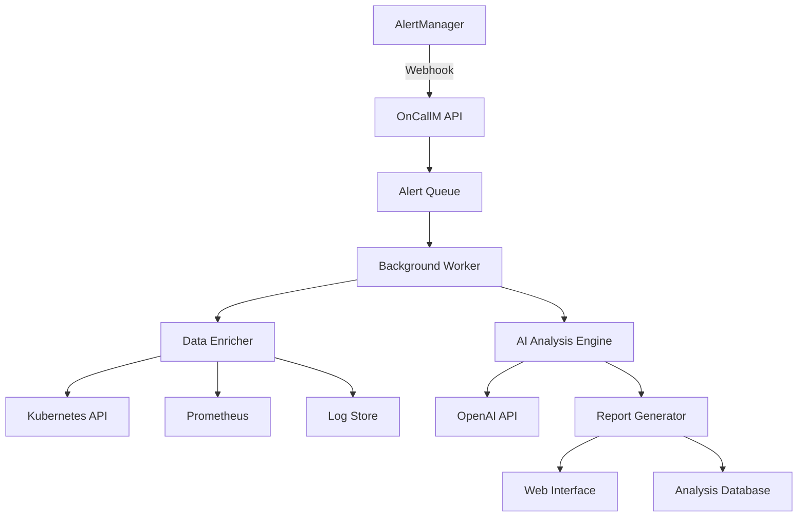

# How It Works

OnCallM uses advanced AI to analyze Kubernetes alerts and provide intelligent root cause detection. Here's how the system works under the hood.

## System Architecture

```
┌─────────────────┐    ┌─────────────────┐    ┌─────────────────┐
│   AlertManager  │───▶│     OnCallM     │───▶│   OpenAI API    │
│                 │    │   Webhook API   │    │   AI Analysis   │
└─────────────────┘    └─────────────────┘    └─────────────────┘
                              │
                              ▼
┌─────────────────┐    ┌─────────────────┐    ┌─────────────────┐
│  Kubernetes     │◀───│  Data Collector │    │ Analysis Report │
│  Cluster API    │    │   & Enricher    │    │  Web Interface  │
└─────────────────┘    └─────────────────┘    └─────────────────┘
```

## Processing Flow

### 1. Alert Reception

When AlertManager sends an alert to OnCallM:

```python
@app.post("/webhook")
async def webhook(alert_group: AlertGroup):
    # Queue alert for processing
    await _alert_queue.put((alert_fingerprint, alert_group))
    
    # Return immediate response
    return {"status": "success", "report_urls": [...]}
```

**Key Features:**
- **Non-blocking**: Immediate response to AlertManager
- **Queued processing**: Alerts processed asynchronously
- **Fingerprint tracking**: Unique ID for each alert

### 2. Data Collection & Enrichment

OnCallM enriches alerts with additional context:

```python
def enrich_alert(alert_group):
    context = {
        "kubernetes_resources": get_k8s_resources(alert),
        "metrics": get_prometheus_metrics(alert),
        "logs": get_application_logs(alert),
        "events": get_k8s_events(alert),
        "historical_data": get_similar_incidents(alert)
    }
    return context
```

**Data Sources:**
- **Kubernetes API**: Pod states, events, resource usage
- **Prometheus**: Metrics and time-series data
- **Log aggregation**: Application and system logs
- **Historical database**: Past incident patterns

### 3. AI Analysis Engine

The core AI analysis happens in multiple stages:

#### Stage 1: Context Understanding
```python
def analyze_context(alert, enriched_data):
    prompt = f"""
    Analyze this Kubernetes alert:
    Alert: {alert.summary}
    Labels: {alert.labels}
    
    Additional Context:
    - Pod Status: {enriched_data.pods}
    - Recent Events: {enriched_data.events}
    - Metrics: {enriched_data.metrics}
    
    Identify the root cause and provide actionable recommendations.
    """
    return openai_client.chat.completions.create(...)
```

#### Stage 2: Pattern Recognition
- **Temporal patterns**: Time-based correlations
- **Service dependencies**: Upstream/downstream impacts
- **Infrastructure patterns**: Node, network, storage issues
- **Application patterns**: Code-related incidents

#### Stage 3: Recommendation Generation
- **Immediate actions**: Stop the bleeding
- **Root cause fixes**: Prevent recurrence
- **Monitoring improvements**: Better observability
- **Capacity planning**: Resource optimization

### 4. Report Generation

Analysis results are formatted into actionable reports:

```python
def generate_report(analysis_result, alert_context):
    report = {
        "summary": analysis_result.summary,
        "root_cause": analysis_result.root_cause,
        "impact_assessment": analysis_result.impact,
        "immediate_actions": analysis_result.actions,
        "recommendations": analysis_result.recommendations,
        "evidence": analysis_result.evidence
    }
    return render_template("report.html", report=report)
```

## Alert Processing Pipeline

### Queue Management

```python
class AlertQueue:
    def __init__(self):
        self.queue = asyncio.Queue()
        self.processing_workers = []
    
    async def process_alerts(self):
        while True:
            fingerprint, alert_group = await self.queue.get()
            await self.analyze_alert(fingerprint, alert_group)
```

**Benefits:**
- **Backpressure handling**: Prevents system overload
- **Priority processing**: Critical alerts first
- **Parallel processing**: Multiple workers
- **Graceful degradation**: Queue limits and fallbacks

### Worker Pool

OnCallM uses a thread pool for blocking operations:

```python
executor = ThreadPoolExecutor(max_workers=10)

async def process_alert_async(fingerprint, alert_group):
    loop = asyncio.get_event_loop()
    await loop.run_in_executor(
        executor, 
        process_alert_sync, 
        fingerprint, 
        alert_group
    )
```

## AI Integration

### OpenAI API Integration

```python
class OncallmAgent:
    def __init__(self):
        self.client = OpenAI(api_key=os.getenv("OPENAI_API_KEY"))
        self.model = os.getenv("OPENAI_MODEL", "gpt-4")
    
    def do_analysis(self, alert_group):
        # Prepare context
        context = self.prepare_context(alert_group)
        
        # Generate analysis
        response = self.client.chat.completions.create(
            model=self.model,
            messages=[
                {"role": "system", "content": SYSTEM_PROMPT},
                {"role": "user", "content": context}
            ]
        )
        
        return self.parse_response(response)
```

### Prompt Engineering

OnCallM uses carefully crafted prompts for optimal AI analysis:

```python
SYSTEM_PROMPT = """
You are an expert Kubernetes and DevOps engineer analyzing production incidents.

Your task is to:
1. Identify the root cause of the alert
2. Assess the impact on services and users
3. Provide immediate action items
4. Suggest long-term improvements

Always provide:
- Clear, actionable recommendations
- Specific kubectl commands when applicable
- Risk assessment for suggested actions
- Expected resolution time
"""
```

## Data Flow Diagram



## Performance Characteristics

### Throughput
- **Alert ingestion**: 1000+ alerts/minute
- **Concurrent analysis**: 50+ alerts simultaneously
- **Response time**: < 30 seconds for 95% of alerts

### Scalability
- **Horizontal scaling**: Multiple OnCallM instances
- **Queue partitioning**: Distribute load across workers
- **Caching**: Reduce redundant API calls
- **Rate limiting**: Protect downstream services

### Reliability
- **Error handling**: Graceful failure modes
- **Retry logic**: Exponential backoff for transient failures
- **Circuit breakers**: Prevent cascade failures
- **Health monitoring**: Self-healing capabilities

## Security Model

### Authentication Flow
```
AlertManager → Bearer Token → OnCallM → API Key → OpenAI
```

### Data Protection
- **Encryption in transit**: TLS for all communications
- **Encryption at rest**: Sensitive data encrypted
- **Data retention**: Configurable retention policies
- **Access control**: RBAC for different user roles

## Monitoring & Observability

### Metrics Collection
```python
# Custom metrics
alert_processing_duration = Histogram('alert_processing_seconds')
alert_queue_size = Gauge('alert_queue_size')
ai_api_calls = Counter('ai_api_calls_total')

@alert_processing_duration.time()
def process_alert(alert):
    # Processing logic
    pass
```

### Health Checks
```python
@app.get("/health")
async def health_check():
    return {
        "status": "healthy",
        "queue_size": _alert_queue.qsize(),
        "ai_service": check_openai_connectivity(),
        "k8s_api": check_kubernetes_connectivity()
    }
```

## Configuration Management

### Environment-based Configuration
```python
class Config:
    OPENAI_API_KEY = os.getenv("OPENAI_API_KEY")
    APP_HOST = os.getenv("APP_HOST", "0.0.0.0")
    APP_PORT = int(os.getenv("APP_PORT", "8001"))
    WORKER_THREADS = int(os.getenv("WORKER_THREADS", "10"))
    
    def validate(self):
        if not self.OPENAI_API_KEY:
            raise ValueError("OPENAI_API_KEY is required")
```

### Dynamic Configuration
- **Feature flags**: Enable/disable features at runtime
- **AI model selection**: Switch between different AI models
- **Analysis depth**: Configure analysis thoroughness
- **Rate limits**: Adjust processing limits

## Error Handling & Recovery

### Graceful Degradation
```python
async def analyze_with_fallback(alert):
    try:
        return await ai_analysis(alert)
    except OpenAIError:
        return basic_rule_based_analysis(alert)
    except Exception as e:
        logger.error(f"Analysis failed: {e}")
        return error_response(alert)
```

### Retry Mechanisms
- **Exponential backoff**: For transient failures
- **Circuit breakers**: For persistent failures
- **Dead letter queues**: For unprocessable alerts
- **Manual intervention**: Human escalation paths

## Next Steps

Now that you understand how OnCallM works:

1. [Explore features in detail](./features.md)
2. [Deploy OnCallM](../deployment/quick-start.md)
3. [Configure for your environment](../configuration/alertmanager.md)
4. [Monitor and optimize](../configuration/environment.md) 